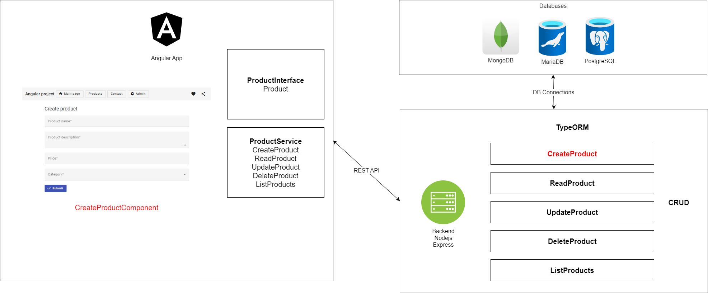

# demoprojektiangular

Create and initialize new github repository

Clone repository to your local machine and open Visual Studio Code

```
git clone https://github.com/OMATUNNUS/OMAPROJEKTI
```

# Initialize angular project
https://angular.io/quick-start

https://angular.io/guide/setup-local

```
Koulun koneilla tulee lisätä käyttäjän polku ympäristömuuttujaksi
D:\Users\pekka.tamminen\AppData\Roaming\npm
$env:Path += ';D:\Users\pekka.tamminen\AppData\Roaming\npm'
```

```
npm install -g @angular/cli
# If running in windows
Set-ExecutionPolicy -Scope CurrentUser -ExecutionPolicy RemoteSigned
# If ng command is not found, check environment Path variable (it should include npm folder)
ng new myApp
#use angular routing : yes
#stylesheet: SCSS
cd myApp
# Running application
ng serve
```

Open test application in web browser http://localhost:4200

# Adding header component to application
```
ng generate component header
```

# Add angular material ui library to project
```
ng add @angular/material
```

# Modifying app.component.html
```
<app-header></app-header>
<router-outlet></router-outlet>
```

# Add material toolbar
https://material.angular.io/components/toolbar/overview

Import toolbar and icons components to app.module.ts

```
import {MatToolbarModule} from '@angular/material/toolbar';
import {MatIconModule} from '@angular/material/icon';

...

  imports: [
    BrowserModule,
    AppRoutingModule,
    BrowserAnimationsModule,
    MatToolbarModule,
    MatIconModule
  ],

```

Copy https://material.angular.io/components/toolbar/examples navigation toolbar example html to header.component.html

# Adding main page to site
```
ng generate component mainpage
```

Add mainpage to routing component https://angular.io/guide/router
```
import { MainpageComponent } from './mainpage/mainpage.component'

const routes: Routes = [
  { path: '', component: MainpageComponent }
];
```

# Create components

Create Contact, Products, Product Info, Admin Site, Admin Create Product, Admin Edit Product components
```
ng generate component contact
ng generate component products
ng generate component productinfo
ng generate component admin
ng generate component admincreateproduct
ng generate component admineditproduct
```

Add new components to router
```
import { ContactComponent } from './contact/contact.component'
import { ProductsComponent } from './products/products.component'
import { ProductinfoComponent } from './productinfo/productinfo.component'
import { AdminComponent } from './admin/admin.component'
import { AdmincreateproductComponent } from './admincreateproduct/admincreateproduct.component'
import { AdmineditproductComponent } from './admineditproduct/admineditproduct.component'

...
const routes: Routes = [
  { path: '', component: MainpageComponent },
  { path: 'contact', component: ContactComponent },
  { path: 'products', component: ProductsComponent },
  { path: 'product/:id', component: ProductinfoComponent },
  { path: 'admin', component: AdminComponent },
  { path: 'admin/product/create', component: AdmincreateproductComponent },
  { path: 'admin/product/edit/:id', component: AdmineditproductComponent }
```

Add links to header component

```
    <a routerLink="" routerLinkActive="active" ariaCurrentWhenActive="page">Main page</a>
    <a routerLink="/products" routerLinkActive="active" ariaCurrentWhenActive="page">Products</a>
    <a routerLink="/contact" routerLinkActive="active" ariaCurrentWhenActive="page">Contact</a>
    <a routerLink="/admin" routerLinkActive="active" ariaCurrentWhenActive="page">Admin</a>
```

# Add admin create page

Add form to admin create page https://material.angular.io/components/form-field/overview

Import required components ex.

```
import { MatFormFieldModule } from '@angular/material/form-field';
import { MatInputModule } from '@angular/material/input';
import { MatSelectModule } from '@angular/material/select';
```

# Create page example

Example admin create page
```
<form class="form">
  <mat-form-field class="d-flex">
      <mat-label>Product name</mat-label>
      <input matInput required>
  </mat-form-field>
  <mat-form-field class="d-flex">
      <mat-label>Product description</mat-label>
      <textarea matInput required></textarea>
  </mat-form-field>
  <mat-form-field class="d-flex">
      <mat-label>Price</mat-label>
      <input matInput required type="number">
  </mat-form-field>
  <mat-form-field class="d-flex">
      <mat-label>Category</mat-label>
      <mat-select required>
          <mat-option value="computer">Computer</mat-option>
          <mat-option value="laptop">Laptop</mat-option>
      </mat-select>
  </mat-form-field>
  <button mat-flat-button color="primary"><mat-icon>check</mat-icon> Submit</button>
</form>
```

# Anathomy of CRUD application, frontend & backend



# Create Product Backend project with TypeORM

```
npm install -g typeorm
typeorm init --express --name typeorm-express-sample --database mongodb
```

Configure and test typeorm
```
npm install
edit src/data-source.ts connection strings
npm start
```

```
export const AppDataSource = new DataSource({
    type: "mongodb",
    host: "asdasdvasdbsdfb.mongo.cosmos.azure.com",
    username: "asdasdvasdbsdfb",
    password: "****************************************",
    port: 10255,
    database: "test",
    ssl: true,
```

Change user entity to product entity
```
    @ObjectIdColumn()
    id: ObjectID

    @Column()
    name!: string

    @Column()
    description!: string

    @Column()
    price!: number

    @Column()
    category!: string
```

Replace User with Product info in ```index.js``` & ```data-source.js```

Rename ```UserController.ts``` to ```ProductController.ts```

```
import { AppDataSource } from '../data-source'
import { NextFunction, Request, Response } from "express"
import { Product } from "../entity/Product"

export class ProductController {

    private productRepository = AppDataSource.getRepository(Product)

    async all(request: Request, response: Response, next: NextFunction) {
        return this.productRepository.find()
    }

    async one(request: Request, response: Response, next: NextFunction) {
        const id = request.params.id        

        const product = await this.productRepository.findOne({
            where: { id }
        })

        if (!product) {
            return "unregistered product"
        }
        return product
    }

    async save(request: Request, response: Response, next: NextFunction) {
        const { name, description, price, category } = request.body;

        const product = Object.assign(new Product(), {
            name,
            description,
            price,
            category
        })

        return this.productRepository.save(product)
    }

    async remove(request: Request, response: Response, next: NextFunction) {
        const id = request.params.id

        let productToRemove = await this.productRepository.findOneBy({ id })

        if (!productToRemove) {
            return "this product not exist"
        }

        await this.productRepository.remove(productToRemove)

        return "product has been removed"
    }

}
```

Replace UserController with ProductController in ```routes.ts```

Add update route and controller
```
    async edit(request: Request, response: Response, next: NextFunction) {
        const id = request.params.id
        const { name, description, price, category } = request.body;

        const product = Object.assign(new Product(), {
            _id: id,
            name,
            description,
            price,
            category
        })

        return this.productRepository.save(product)
    }
```
```
, {
    method: "put",
    route: "/products/:id",
    controller: ProductController,
    action: "edit"
}
```

Test REST API
```
$Example = @{"name"="value1";"description"="value2";"price"=123;"category"="value3"} | ConvertTo-Json

#Create new product
Invoke-RestMethod -Method POST -Uri "http://localhost:3000/products" -Body $Example -ContentType "application/json"

#Find existing product
$ID = "63cfb28e949dfb4758ecde95"
Invoke-RestMethod -Method GET -Uri "http://localhost:3000/products/$ID"

#Edit existing product
$ID = "63cfb28e949dfb4758ecde95"
Invoke-RestMethod -Method PUT -Uri "http://localhost:3000/products/$ID" -Body $Example -ContentType "application/json"

#Delete existing product
$ID = "63cfb91bf72edf3a14eb272e"
Invoke-RestMethod -Method DELETE -Uri "http://localhost:3000/products/$ID"
```

# Environment variables
Moving data source connection to environment variable

```
import "reflect-metadata"
import { DataSource } from "typeorm"
import { Product } from "./entity/Product"
import * as dotenv from "dotenv"
dotenv.config();

export const AppDataSource = new DataSource({
    type: "mongodb",
    host: process.env.host,
    username: process.env.username,
    password: process.env.password,
    port: parseInt(process.env.port),
    database: process.env.database,
    ssl: Boolean(process.env.ssl),
    synchronize: true,
    logging: false,
    entities: [Product],
    migrations: [],
    subscribers: [],
})
```

Create ```.env``` and ```.template.env``` files. For ```.env``` file replace placeholders username password etc to production values. Make sure that ```.gitignore``` have ```.env``` in contents
```
type="mongodb"
host="***.mongo.cosmos.azure.com"
username="***"
password="****"
port=10255
database="test"
ssl=true
```

# Create Config service
Create config service which returns application configurations to other components and service
```
ng generate service config/config
```
```
ng generate interface config/config
```
Create example config file ```asset/config.json```
```
{
    "backend": "http://localhost:3000"
}
```

# Creating Product service, Backend service & Product interface

Create Product service for product management (list, create, read, update, delete)
```
ng generate service product/product
```

Create Product interface which tells what kind of properties Product haves
```
ng generate interface product/product
```

Create Backend service for http requests to backend rest api
```
ng generate service backend/backend
```

# Create Product interface

Edit ```product/product.ts```
```
export interface Product {
    _id: string
    name: string
    description: string
    price: number
    category: "Computer" | "Laptop";
}
```

# Create Product backend service

Install and import dependencies in ```app.module.ts``` file
```
...
import { HttpClientModule } from '@angular/common/http';
...
  imports: [
    BrowserModule,
    // import HttpClientModule after BrowserModule.
    HttpClientModule,
```
